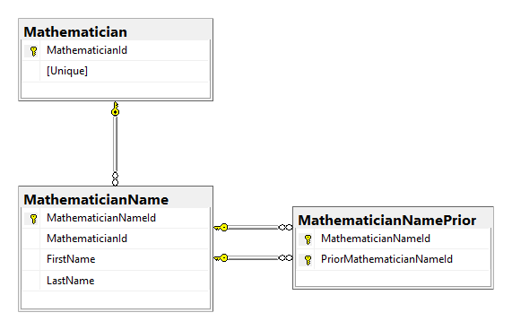

# Data Access Layer (DAL)

The Mathematicians domain is stored in a relational database. The Data Access Layer uses Entity Framework to map the [Domain](domain.md) objects to relational tables.



The database has three tables:

- Mathematician - the identity of a mathematician
- MathematicianName - a version of the name of a mathematician
- MathematicianNamePrior - relates a prior version of a name to the version that replaces it

## Mathematician

The `Mathematician` table records only the identity properties of a mathematician. It does not contain any mutable columns. The `MathematicianId` is for internal use only, and serves as the primary key. The `Unique` GUID represents the actual identity of the mathematician, and is the only ID visible outside of the system:

```sql
CREATE TABLE [Mathematician] (
    [MathematicianId] INT IDENTITY (1,1) NOT NULL,
    [Unique] UNIQUEIDENTIFIER NOT NULL,
    CONSTRAINT [PK_Mathematician] PRIMARY KEY CLUSTERED ([MathematicianId]),
    INDEX [UX_Mathematician_Unique] UNIQUE NONCLUSTERED ([Unique])
)
```

## MathematicianName

The `MathematicianName` table records one row per version of the name of a given mathematician over time. The records themselves don't change. This table does not permit UPDATEs or DELETEs. To change the name you INSERT a new version.

```sql
CREATE TABLE [MathematicianName] (
    [MathematicianNameId] INT IDENTITY (1,1) NOT NULL,
    [MathematicianId] INT NOT NULL,
    [FirstName] NVARCHAR(50) NOT NULL,
    [LastName] NVARCHAR(50) NOT NULL,
    [HashCode] BINARY(32) NOT NULL,
    INDEX [IX_MathematicianName_MathematicianId] NONCLUSTERED ([MathematicianId]),
    CONSTRAINT [FK_MathematicianName_MathematicianId] FOREIGN KEY ([MathematicianId])
        REFERENCES [Mathematician] ([MathematicianId]),
    CONSTRAINT [PK_MathematicianName] PRIMARY KEY CLUSTERED ([MathematicianNameId])
)
```

Notice the 32 byte binary hash code. This stores a SHA256 hash of the version so that we can quickly identify it. The hash not only covers the `FirstName` and `LastName` properties, but also all previous versions of the name. That ensures that similar names that occur at different times in history are distinct.

## MathematicianNamePrior

The `MathematicianNamePrior` table associates a `MathematicianName` with the versions that it replaces.

```sql
CREATE TABLE [MathematicianNamePrior] (
    [MathematicianNameId] INT NOT NULL,
    [PriorMathematicianNameId] INT NOT NULL,
    INDEX [IX_MathematicianNamePrior_MathematicianNameId] NONCLUSTERED ([MathematicianNameId]),
    CONSTRAINT [FK_MathematicianNamePrior_MathematicianNameId] FOREIGN KEY ([MathematicianNameId])
        REFERENCES [MathematicianName] ([MathematicianNameId]),
    INDEX [IX_MathematicianNamePrior_PriorMathematicianNameId] NONCLUSTERED ([PriorMathematicianNameId]),
    CONSTRAINT [FK_MathematicianNamePrior_PriorMathematicianNameId] FOREIGN KEY ([PriorMathematicianNameId])
        REFERENCES [MathematicianName] ([MathematicianNameId]),
    CONSTRAINT [PK_MathematicianNamePrior] PRIMARY KEY CLUSTERED ([MathematicianNameId], [PriorMathematicianNameId])
)
```

An association is only created between a name and its immediate predecessors. Transitive relationships are not directly represented.

Can you see how to find only the current version of a mathematician's name? Can you see how the data structure allows for multiple simultaneous current versions? How is this related to conflicts? How does this data structure support resolving those conflicts?