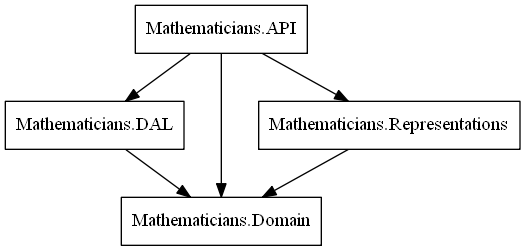

# Mathematicians Historical Modeling Reference Sample

Historical Modeling is a series of patterns for building distributed systems. It treats all records as partially ordered immutable facts. This reference sample demonstrates how to build a relational database, a domain layer, and a REST API historically.

The sample is comprised of four projects:

- [Domain](Overview/domain.md) - the core logic
- [DAL](Overview/dal.md) - the data access layer
- [Representations](Overview/representations.md) - JSON data structures for REST
- API - the controllers and a simple Web client
